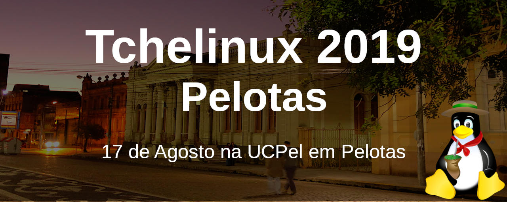
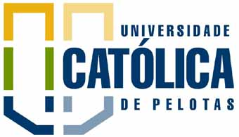

## Sobre

O grupo de usuários de Software Livre Tchelinux, em parceria com a [Universidade Católica de Pelotas](https://ucpel.edu.br/), tem o prazer de convidar a comunidade para participar do evento que ocorrerá no dia **24 de Agosto de 2019 a partir das 8:30h** no Campus I da Universidade Católica de Pelotas.

> **Importante:** O credenciamento e as atividades de abertura do evento irão acontecer no **Auditório Dom Antônio Zattera** (acesso pela rua Três de Maio quase esquina com Félix da Cunha) e as demais palestras irão acontecer nas **Salas 327, 333, 335, 336 e 338** no 3º andar do Campus I da UCPel (acesso pela rua Gonçalves Chaves, 373). 

## Inscrições

 O evento tem **entrada franca**, porém os participantes são **encorajados a doar 2kg de alimentos não perecíveis (exceto sal)**, que são encaminhados ao **Banco de Alimentos de Pelotas**. Os alimentos serão recebidos no momento do credenciamento.

<a href="https://pelotas.tchelinux.org/inscricoes/" style="color:#ff4040"><h3><b>Clique aqui e faça sua inscrição!</b></h3></a>

## Certificados

Serão fornecidos certificados digitais para os participantes do evento, que confirmaram sua presença. Para obtê-los, você deverá utilizar o email fornecido na sua inscrição para o evento. Não esqueça de confirmar sua presença no credenciamento para que os certificados possam ser emitidos.

## Programação

| 
 Horário 
 | 
 **Sala 327**   SysAdmin, DevOps e Big Data   <small>(65 lugares)</small> 
 | 
 **Sala 333**   Desenvolvimento e Banco de Dados   <small>(80 lugares)</small> 
 | 
 **Sala 335**   IoT, Kernel e Embarcados   <small>(55 lugares)</small> 
 | 
 **Sala 336**   Aplicativos, Multimídia e Produtividade   <small>(65 lugares)</small> 
 | 
 **Sala 338**   Comunidade, Distros e Segurança   <small>(80 lugares)</small> 
 |
|:--------------------------:|:-----------------------:|:-----------------------:|:-----------------------:|:-----------------------:|:-----------------------:|
| **08:30** <td colspan=6>
**Credenciamento**
 |
| **09:00** <td colspan=6>
**Abertura**  Auditório Dom Antônio Zattera   Todo o público    Equipe Tchelinux   
 |
| **09:15** <td colspan=5>
[**Keynote: 25 anos de Linux na UCPel**](#Keynote:_25_anos_de_Linux_na_UCPel)  Auditório Dom Antônio Zattera   Todo o público  Adenauer Yamin, Fabio Olivé Leite e João Avelino Bellomo Filho  
 |
| **10:20** | [**Afinal o que aconteceu com o HTTP2?**](#Afinal_o_que_aconteceu_com_o_HTTP2?)   Intermediário   Nelson Dutra Junior |  [**Banco de Dados Livres: Conceitos e Aplicações**](#Banco_de_Dados_Livres:_Conceitos_e_Aplicações)   Principiante   Willian Barreto Froes | [**Tecnologia assistiva para deficientes visuais com auxilio de beacons.**](#Tecnologia_assistiva_para_deficientes_visuais_com_auxilio_de_beacons.)   Principiante   Everton Almeida | [**Explorando Editores de Texto Open Source**](#Explorando_Editores_de_Texto_Open_Source)   Principiante   Gabriel Prestes Ritta | [**A caminho da certificação OCAJP 8**](#A_caminho_da_certificação_OCAJP_8)   Intermediário   Érick Luiz Fonsêca Lopes | 
| **11:10** | [**Principais motivos pelos quais você precisa ter um backup do seu ambiente**](#Principais_motivos_pelos_quais_você_precisa_ter_um_backup_do_seu_ambiente)   Principiante   Bruna Martins | [**PHP e PostgreSQL: Dois elefantes ajudando no seu projeto!**](#PHP_e_PostgreSQL:_Dois_elefantes_ajudando_no_seu_projeto!)   Intermediário   Everton Catto Heckler | [**Fazer ou não fazer meu próprio SO, eis a questão**](#Fazer_ou_não_fazer_meu_próprio_SO,_eis_a_questão)   Intermediário   Carlos Santos | [**Rock & Code - Como criar música programando**](#Rock_&_Code_-_Como_criar_música_programando)   Principiante   Jerônimo Medina Madruga | [**O bom, o mau e o feio: três momentos da instalação do Linux**](#O_bom,_o_mau_e_o_feio:_três_momentos_da_instalação_do_Linux)   Principiante   Vinícius Alves Hax | 
| **12:00** <td colspan=6>
**Intervalo para Almoço**
 |
| **13:30** | [**DevOps: Passado, presente e futuro**](#DevOps:_Passado,_presente_e_futuro)   Principiante   Cristiano dos Santos Diedrich | [**Porque Você Deve Aprender Rust**](#Porque_Você_Deve_Aprender_Rust)   Principiante   Julio Biason |  [**Keynote OS Systems**](#Keynote_OS_Systems)   Principiante   OS Systems | [**"Essa câmera faz fotos muito boas, né?"**](#"Essa_câmera_faz_fotos_muito_boas,_né?")   Principiante   Rafael Guterres Jeffman | [**O que mudou ao longo de 25 anos trabalhando com Software Livre?**](#O_que_mudou_ao_longo_de_25_anos_trabalhando_com_Software_Livre?)   Principiante   Carlos Santos |
| **14:20** | [**Kubernetes para iniciantes**](#Kubernetes_para_iniciantes)   Principiante   Crisitiano dos Santos Diedrich | [**Introdução ao desenvolvimento Android com Kotlin**](#Introdução_ao_desenvolvimento_Android_com_Kotlin)   Principiante   Ricardo Peixoto Robaina | [**Entendendo o Systemd**](#Entendendo_o_Systemd)   Intermediário   João Avelino Bellomo Filho | [**Fazendo Arte com Software Livre**](#Fazendo_Arte_com_Software_Livre)   Principiante   Jefferson e Silva Nascimento | [**A anatomia de um CVE: como falhas de segurança surgem e são resolvidas em projetos de Software Livre**](#A_anatomia_de_um_CVE:_como_falhas_de_segurança_surgem_e_são_resolvidas_em_projetos_de_Software_Livre)   Intermediário   Fabio Olive Leite | 
| **15:10** <td colspan=6>
**Coffee-Break**
 |
| **15:40** | [**Filosofando Sobre Testes**](#Filosofando_Sobre_Testes)   Principiante   Julio Biason | [**Introdução a Vue.js**](#Introdução_a_Vue.js)   Principiante   João Pedro Sabbado Pereira | [**UpdateHub: A solução para atualização Over The Air de dispositivos IoT**](#UpdateHub:_A_solução_para_atualização_Over_The_Air_de_dispositivos_IoT)   Intermediário   Otavio Salvador e Diandra Martini | [** Maneiras fantásticas de tornar sua organização pessoal mais refrescante do que meias limpas!**](#Maneiras_fantásticas_de_tornar_sua_organização_pessoal_mais_refrescante_do_que_meias_limpas!)   Principiante   Júlio César Medina Madruga | [**(In)Segurança na Internet**](#Insegurança_na_Internet)   Intermediário   Diego Luiz Silva da Costa | 
| **16:30** | [**O que é Ciência de Dados **](#O_que_é_Ciência_de_Dados)   Principiante   Lorenzo Fagundes Antunes | [**Dados no espaço-tempo: Trabalhando com Dados Georreferenciados no MongoDB**](#Dados_no_espaço-tempo:_Trabalhando_com_Dados_Georreferenciados_no_MongoDB)   Principiante   Ricardo Peixoto Robaina | [**Zephyr Project, o RTOS do momento!**](#Zephyr_Project,_o_RTOS_do_momento!)   Intermediário   Otavio Salvador | [**Usando métodos ágeis para alavancar o seu projeto**](#Usando_métodos_ágeis_para_alavancar_o_seu_projeto)   Principiante   Rodrigo Ferro | [**Aumentando a segurança em casa: hands on prático e simples**](#Aumentando_a_segurança_em_casa:_hands_on_prático_e_simples)   Intermediário   Diego Luiz Silva da Costa | 
| **17:20** <td colspan=6>
**Encerramento**  Auditório Dom Antônio Zattera    Todo o público   Equipe Tchelinux   
 |

## Palestras

### Afinal o que aconteceu com o HTTP2?

Você já deve ter ouvido falar sobre HTTP2, certo? Se sim está palestra é para você, senão também! O HTTP2 é a evolução do principal protocolo de acesso a internet que veio para trazer melhorias, mas afinal o que aconteceu com ele? Nesta palestra além contextualizar historicamente e apresentar as melhorias que a nova versão do protocolo trouxe discutirei sua implementação e seu uso na internet. 

### Nelson Dutra Junior

[**Nelson Dutra Junior**](https://www.linkedin.com/in/dutrafox/) é Graduando em Engenharia de Computação pela UFPel, entusiasta de Software Livre, presidente na UFPel Rocket Team, foi voluntário na Comunidade Mozilla Brasil e atua como desenvolvedor Full Stack.

### Banco de Dados Livres: Conceitos e Aplicações

Nesta apresentação serão vistos conceitos básicos sobre Bancos de Dados, tabelas e algumas boas práticas para estruturar uma base de dados através de diagramas, no final, será demonstrado como algumas operações SQL operam em cima da base de dados.

### Willian Barreto Froes

**William Barreto Froes** é graduando em Tecnologia em Análise e Desenvolvimento de Sistemas e Estagiário na Compasso Tecnologia de Rio Grande. Trabalha na área desde 2012, tendo começado com desenvolvimento de Games atuando na parte de modelagem e ambientação 3D, participei de projetos como Fearg/Fecis App 2016, Anima Soul: Cosplay Run e Connect Schools. Além disso, desenvolve projetos Web utilizando tecnologias como HTML5, CSS3, JavaScript, Bootstrap, Materialize, PHP, MySQL, PostgreSQL e Node.JS.

### Tecnologia assistiva para deficientes visuais com auxilio de beacons. 

Essas tecnologias visam ajudar pessoas com deficiência visual a se locomoverem sem que precisem de ajuda de outras pessoas, apenas com o uso do seu smartphone. Isso é possível através de um amplificador bluetooth chamado beacon. Nessa palestra vou ensinar a utilização do beacon no Android Studio em JAVA e a criação de uma tecnologia assistiva acessível para deficientes visuais. 

### Everton Almeida

[**Everton Almeida**](https://github.com/evertondealmeida) é formando em Análise e Desenvolvimento de Sistemas no Instituto Federal do Rio Grande do Sul. Profissional atuando no mercado de desenvolvimento de software a mais de 2 anos.

### Explorando Editores de Texto Open Source 

O objetivo da palestra é apresentar a funcionalidade dos editores de texto open source(com foco em LibreOffice e OpenOffice) para usuários de software livre e para aqueles que desejam migrar para a iniciativa open source, demonstrando a ampla capacidade destes programas na produção de textos, como artigos, livros e trabalhos acadêmicos. 

### Gabriel Prestes Ritta

[**Gabriel Prestes Ritta**](https://www.facebook.com/gabriel.ritta) é escritor e autor da série literária "Lendas de Um Mundo Perdido", publicada pela Editora Viseu, de artigos publicados em jornais e de obras da plataforma Wattpad. Além disso, é um entusiasta do software livre, principalmente no que tange a área da escrita e do Design. Possui experiência com ferramentas variadas, como LibreOffice Writer, Blender 3D, Gimp e Kdenlive. Atualmente, cursa o terceiro ano do ensino médio e pretende formar-se em áreas da ciência e tecnologia.

### A caminho da certificação OCAJP 8 

O desenvolvimento cotidiano conta com ferramentas que facilitam nosso dia a dia, e mais do que isso, nos escondem alguns pontos cruciais em provas que nos habilitam nas tecnologias. Na palestra apresento os primeiros passos para fazer a certificação e, também, pontos que podem nos pegar desprevenidos na hora da prova. 

### Érick Luiz Fonsêca Lopes

[**Érick Luiz Fonsêca Lopes**](https://www.linkedin.com/in/erick-luiz-98b956105/)

Graduado como aluno destaque em Sistemas de Informação (1/2018), na oportunidade, trabalhei com tecnologia assistiva e educação popular. Atualmente sou Desenvolvedor de Software na empresa Compasso Tecnologia atuando no desenvolvimento de integrações para sistema Marketplace. Pós graduando em tecnologias Web.

### Principais motivos pelos quais você precisa ter um backup do seu ambiente 

Nesta palestra vou apontar os 2 principais motivos pelo qual você precisa ter uma cópia de segurança dos seus dados, as ferramentas de mercado que podem te ajudar nesta estratégia e algumas dicas. 

### Bruna Martins

[**Bruna Martins**](https://www.linkedin.com/in/brunagrellt/) é Customer Success na Adentro Cloud Solutions, empresa de Data Center, na qual está auxiliando o desenvolvimento da Cultura de Sucesso do Cliente em conjunto com a reestruturação de atendimento da equipe de Suporte e Comercial.

### PHP e PostgreSQL: Dois elefantes ajudando no seu projeto! 

Dependendo do sistema onde vamos aplicar está técnica de Full-text search usamos ferramentas como Elasticsearch, Apache Solr, Lucene. Com está palestra pretendo mostrar uma alternativa simples para aqueles sistemas pequenos onde ainda não precisamos aplicar um esforço/Custo ao projeto, pretendo utilizar uma abordagem mostrando como se é feito "no braço" e depois a formar mais simples. utilizaremos nesta palestra PHP, PostgreSQL, Framework Laravel. 

### Everton Catto Heckler

[**Everton Catto Heckler**](https://www.linkedin.com/in/everton-heckler/) é CEO da Catto Tecnologia Aplicada.

### Fazer ou não fazer meu próprio SO, eis a questão 

A palestra discutirá os prós e contras de construir ou não um SO personalizado em vez de usar uma distribuição existente, já adaptada para sistemas embarcados. Será dado um exemplo de como fazer isso usando a ferramenta Buildroot.

### Carlos Santos

[**Carlos Santos**](https://www.linkedin.com/in/unixmania/) é Engenheiro agrícola, acredite quem quiser (UFPel, 1988), Pesquisador bolsista (EMBRAPA, 1989-1993), Programador e gerente de redes (CPMet/UFPel, provedores de serviços Internet, 1993-1999), Mestre em Ciência da Computação, na área de Computação Gráfica (UFRGS, 1998-2000), Professor de CG, programação e redes (URI, Santo Ângelo, 2001-2005), Engenheiro de software (HP, 2005-2013), Engenheiro de manutenção de software (Red Hat, 2013-2014), Arquiteto de software (DATACOM, 2014-2019) e Engenheiro de manutenção de software, de novo (Red Hat, 2019-).

### Rock & Code - Como criar música programando 

A maioria dos métodos para aprender programação envolvem operações matemáticas e lógicas, o que não é muito atraente para muita gente, afinal nem todos acham incrível quando finalmente conseguem fazer um merge sorte ou uma árvore binária... Então, que tal tentar algo diferente, como juntar música e programação? Nessa palestra será apresentado Sonic Pi, um sintetizador digital que permite que as pessoas criem música como se estivessem programando! A ideia é mostrar como instalar e configurar a ferramenta, e por fim fazer um pouco de rock & roll com código! 

### Jerônimo Medina Madruga

[**Jerônimo Medina Madruga**](https://www.linkedin.com/in/jmmadruga/) trabalha com suporte técnico e treinamento para educação a distância da Universidade Federal de Pelotas (UFPel). Tem formação em Técnico em Eletrônica pelo Instituto Federal Sul-Rio-Grandense (IFSUL), Tecnólogo em Marketing pelo Centro Universitário de Maringá (UniCesumar) e é ocasionalmente atuante em grupos ligados a divulgação e desenvolvimento de software livre. Já realizou mais de 70 palestras em eventos internacionais, nacionais e regionais, sobre os temas mais variados possíveis, normalmente ligados a educação, programação, comunidades, CMS e administração de sistemas.

### O bom, o mau e o feio: três momentos da instalação do Linux 

A palestra vai ajudar os participantes nas diversas etapas da instalação do Linux. O antes: como escolher uma distribuição Linux? Qual é a melhor para cada pessoa? Quais cuidados antes de instalar? O durante: através de fotos vou mostrar as opções do instalador de 4 populares distribuições Linux: Mint, Ubuntu, Debian Server e Fedora. E o depois: alguns programas úteis que podem ser instalados depois para tornar a vida mais fácil.

### Vinícius Alves Hax

[**Vinícius Alves Hax**](http://viniciusah.com.br) é formado em Engenharia de Computação pela FURG e trabalha atualmente como Analista de TI na reitoria do IFSul. Utiliza Linux há quase quinze anos e tem experiência em desenvolvimento web e como administrador de sistemas, sempre utilizando preferencialmente o sistema livre.

### DevOps: Passado, presente e futuro 

A vida de quem trabalha com tecnologia muda constantemente, a cada dia surgem mais e mais soluções, metodologias e formas de melhorar o nosso trabalho. DevOps é um dos diversos termos que se destacam nos últimos anos, então nada melhor do que conversarmos um pouco sobre ele, entender como ele pode ajudar as empresas atualmente e pensarmos juntos em como será não só DevOps mas sim, nossa vida com DevOps. 

### Cristiano dos Santos Diedrich

[**Cristiano dos Santos Diedrich**](https://www.mundodocker.com.br) é entusiasta Open Source, seu principal foco é ir atrás de ideias novas e torna-las realidade através de soluções simples e eficientes. É organizador do Meetup Docker Porto Alegre, Meetup DevOps/SRE Porto Alegre e DevOpsDays Porto Alegre.

### Porque Você Deve Aprender Rust

Rust (a linguagem, não o jogo) é uma linguagem que produz código em que a memória é protegida. Trazendo muitas das funcionalidades de linguagens funcionais, com abstrações de alto nível e performance semelhante a C, Rust é uma linguagem que você realmente deve aprender. 

### Julio Biason

[**Julio Biason**](https://functional.cafe/@juliobiason) é programador desde os 12 anos e já conheceu várias linguagens, mas nenhuma que fosse tão interessante quanto Rust.

### Keynote OS Systems

[**O.S. Systems**](https://www.ossystems.com.br/) O.S. Systems was founded in 2002, due to the lack of options on the market of companies able to perform operating system customization and specialized consultancy in open source software. Since then, we are actively engaged to many world class projects and teams.

### Otavio Salvador

[**Otavio Salvador**](https://github.com/otavio) é empresário, escritor e entusiasta de Software Livre. Está envolvido com desenvolvimento de Linux Embarcado desde 2008 em diferentes indústrias.

### "Essa câmera faz fotos muito boas, né?" 

Durex, Xerox, Über e Photoshop, são marcas, não verbos ou substantivos. Nessa palestra vamos passar por uma parte obscura da fotografia digital, o gerenciamento de seus ativos digitais, que é ainda mais obscuro, no mundo do software livre. Sairemos da captura, passando pela organização, edição, indo até a publicação. E vamos garantir que esses arquivos não se percam em caso de desastres, e você tenha uma resposta positiva quando a esposa pergunta "tu não perdeu aquela foto, né?" 

### Rafael Guterres Jeffman

[**Rafael Guterres Jeffman**](https://github.com/rafasgj) é fotógrafo, impressor e professor universitário. Leciona as disciplinas de algoritmos, estruturas de dados e desenvolvimento de jogos. Colaborou por anos com a distribuição GoboLinux. Entre seu projetos atuais, está um sistema de gerenciamento de ativos digitais multiplataforma, open source.

### O que mudou ao longo de 25 anos trabalhando com Software Livre? 

Uma revisão histórica do que mudou na tecnologia e no mercado de trabalho desde que o software livre rompeu os limites do meio acadêmico e científico e se disseminou no Brasil, a partir do início dos anos 90. 

### Carlos Santos

[**Carlos Santos**](https://www.linkedin.com/in/unixmania/) é Engenheiro agrícola, acredite quem quiser (UFPel, 1988), Pesquisador bolsista (EMBRAPA, 1989-1993), Programador e gerente de redes (CPMet/UFPel, provedores de serviços Internet, 1993-1999), Mestre em Ciência da Computação, na área de Computação Gráfica (UFRGS, 1998-2000), Professor de CG, programação e redes (URI, Santo Ângelo, 2001-2005), Engenheiro de software (HP, 2005-2013), Engenheiro de manutenção de software (Red Hat, 2013-2014), Arquiteto de software (DATACOM, 2014-2019) e Engenheiro de manutenção de software, de novo (Red Hat, 2019-).

### Kubernetes para iniciantes 

Falar em containers é quase falar do passado, pois atualmente esse tipo de tecnologia deixou de ser revolucionário para ser necessário. Obviamente isso gera grandes desafios, principalmente em manter este tipo de ambiente sempre rodando. Para isso existem muitas ferramentas, entre elas o Kubernetes, você sabe o que é? Como ele funciona? Vamos responder juntos essas e outras questões do mais utilizado orquestrador de containers dos dias de hoje. 

### Crisitiano dos Santos Diedrich

[**Cristiano dos Santos Diedrich**](https://www.mundodocker.com.br) é entusiasta Open Source, seu principal foco é ir atrás de ideias novas e torna-las realidade através de soluções simples e eficientes. É organizador do Meetup Docker Porto Alegre, Meetup DevOps/SRE Porto Alegre e DevOpsDays Porto Alegre.

### Introdução ao desenvolvimento Android com Kotlin 

Atualmente, cerca de 88% dos dispositivos móveis utilizam o sistema operacional Android. No Google I/O de 2017, a linguagem de programação Kotlin foi incluída como uma linguagem com suporte oficial para o desenvolvimento desta plataforma. Essa palestra tem como objetivo introduzir o processo de desenvolvimento de aplicativos Android, utilizando a linguagem de programação Kotlin. 

### Ricardo Peixoto Robaina

[**Ricardo Peixoto Robaina**](https://github.com/robainaricardo) é bacharel em Engenharia de Computação pela Universidade Federal do Pampa, foi honrado com o prêmio SBC como aluno destaque de sua turma. Apaixonado por computação e por Software Livre, possui experiência com desenvolvimento de simuladores, jogos sérios, classificadores e aplicações móveis, além de trabalhos relacionados ao desenvolvimento de aceleradores de hardware e co-design. Atualmente é mestrando no Programa de Pós-Graduação em Computação Aplicada (PPGCAP) da UNIPAMPA e voluntário do Tchelinux.

### Entendendo o Systemd 

O Systemd é o software hoje utilizado pela maioria das distribuições Linux para a inicialização do sistema. Ele apresenta uma infinidade de melhorias em relação aos sofwares anteriores e, ao mesmo, tempo apresenta uma série de novos desafios. Essa apresentação visa identificar os pontos chave dele, enfatizando a nova forma de visualizar o funcionamento da inicialização, bem como mostrar algumas das ferramentas complementares a ele. 

### João Avelino Bellomo Filho

[**João Avelino Bellomo Filho**](https://www.linkedin.com/in/jo%C3%A3o-avelino-bellomo-filho-0b2229a/) é Tecnólogo em Processamento de Dados pela Universidade Católica de Pelotas, Mestre em Ciência da Computação pela Universidade Federal do Rio Grande do Sul. É usuário de Fedora Linux e atualmente é Desenvolvedor na Azion Technologies.

### Fazendo Arte com Software Livre

O objetivo desta apresentação é demonstrar Softwares Livres como o OpenToonz, Krita e Blender voltados ao campo artístico e seus usos.

### Jefferson e Silva Nascimento

[**Jefferson e Silva Nascimento**](https://www.linkedin.com/in/jeffthejeff) é Graduando em Cinema de Animação pela UFPel, foi premiado pelo videoclipe 313 experimentos de Gerson no Expocom Sul 2019. Ministrou oficinas de animação 2D e 3D com Software Livre em Semanas Academicas da UFPel e foi estagiário com arte para jogos e arte técnica no estúdio Izyplay. 

### A anatomia de um CVE: como falhas de segurança surgem e são resolvidas em projetos de Software Livre 

Se você já ouviu falar em CVE, CVSS, CWE, CRD e outras siglas estranhas ao se informar sobre um bug de segurança e ficou curioso, esta palestra é para você.  Serão abordados os principais conceitos e processos relacionados ao gerenciamento e coordenação do trabalho de corrigir falhas de segurança no mundo open source, e também como identificar, avaliar e reportar falhas de maneira correta e colocar CVEs no seu currículo.

### Fabio Olive Leite

[**Fabio Olive Leite**](https://fedoraproject.org/wiki/User:Fleite) usa Linux e Free Software a 25 anos, passou pelo Slackware, pelo antigo Red Hat Linux, Debian, Conectiva Linux (onde trabalhou por 3 anos) e depois de largar o Linux, usou o OpenBSD por um tempo. Em 2006 ajudou a fundar o Tchelinux no mesmo ano em que começou a trabalhar para a Red Hat (onde está desde então), e é um feliz usuário de Fedora.

### Filosofando Sobre Testes 
O que é um "teste de unidade"? A unidade realmente existe? O que ela é? Essas perguntas todo desenvolvedor um dia se perguntou quando falou de TDD, e aqui vamos discutir um pouco do que é testar e o que os testes representam para o produto final. 

### Julio Biason

[**Julio Biason**](https://functional.cafe/@juliobiason) é programador desde os 12 anos e já teve que lidar com vários formatos de testes desde então.

### Introdução a Vue.js 

Tem por objetivo construir o ambiente para o desenvolvimento, utilizando o Framework Vue.js, ilustrando de forma prática, as principais utilizações de suas estruturas conforme o manual oficial (https://vuejs.org/v2/guide/). Também oferecendo um panorama geral dos framework's e bibliotecas reativas de javascript que atualmente sustentam este mercado (Angular, React e Vue), em conjunto com uma base teórica sobre o funcionamento destas tecnologias. 

### João Pedro Sabbado Pereira

[**João Pedro Sabbado Pereira**](https://www.linkedin.com/in/joão-pedro-sabbado-pereira-a41508128) é Desenvolvedor no Grupo Lins Ferrão (Lojas Pompeia). Cursando o último semestre do curso Análise e Desenvolvimento de Sistemas oferecido pelo IFSul Campus Camaquã.
 
### UpdateHub: A solução para atualização Over The Air de dispositivos IoT

Pensando na velocidade com que dispositivos IoT vem ganhando espaço nos mais diversos ramos de negócio, o UpdateHub é uma solução OTA (Over The Air) de nível corporativo que visa oferecer agilidade e segurança, além de facilitar o processo de atualização remota de firmware (FOTA - Firmware Over The Air). Tendo como principal benefício a possibilidade de aprimoramento e correções de um grande número de dispositivos a partir de um só lugar, o UpdateHub é a solução mais completa para resolver o desafio de atualizar dispositivos embarcados nas mais diferentes indústrias.

### Otavio Salvador

[**Otavio Salvador**](https://github.com/otavio) é empresário, escritor e entusiasta de Software Livre. Está envolvido com desenvolvimento de Linux Embarcado desde 2008 em diferentes indústrias.

[**Diandra Martini**](https://br.linkedin.com/in/diandramartini) é formada em Relações Internacionais pela UFPel e trabalhando atualmente como Analista de Negócios na O.S. Systems.

###  Maneiras fantásticas de tornar sua organização pessoal mais refrescante do que meias limpas! 

Você sabia que 20% de nossas soluções são resultado de 80% de nossos esforços ao longo do dia? Aprenda a organizar sua vida com metodologias e apps, e encontre tempo para fazer também o que gosta! 

### Júlio César Medina Madruga

[**Júlio César Medina Madruga**](https://www.linkedin.com/in/juliomadruga) é Cantor, TAE de T.I., entusiasta de sustentabilidade, PNL e coaching. Trabalha no Núcleo de Tecnologia de Informação da Universidade Federal do Rio Grande – FURG. Um bagunceiro no limiar entre a Informação e a Comunicação, fazendo papel de advogado do diabo dos aplicativos onipresentes de anotação em prol da organização pessoal.

### Insegurança na Internet

Estamos conectados cada vez mais, mas será que manter o padrão nos deixa seguros na internet? .... Nesta palestra, que foi tema que ministrei no 1º Simpósio Regional de Segurança Cibernética, realizado pela Marinha do Brasil. Irei de maneira simples comentar sobre os aspectos relacionados a nossa segurança digital em um mundo pós Edward Snowden.

### Diego Luiz Silva da Costa

[**Diego Luiz Silva da Costa**](https://wiki.projetoroot.com.br/) é o idealizador e mantenedor do Canal no YouTube Projeto Root, que nasceu, em maio de 2014, a partir de uma ideia sua ainda na graduação em Redes de Computadores, na Faculdade de Tecnologia SENAC Pelotas. O canal tem como propósito o ensino gratuito sobre Tecnologia, Software Livre, GNU-Linux, Redes de Computadores e Segurança da Informação.

### O que é Ciência de Dados  

Esta palestra visa introduzir o tema de Ciência de Dados para um público maior, com a finalidade mostrar como Ciência de Dados funciona, quais são os papéis que o Cientista de Dados ocupa, quais suas principais atribuições, etc. Também mostrará algumas das ferramentas utilizadas e comentará como o mercado de ciência de dados está se desenvolvendo no Brasil. 

### Lorenzo Fagundes Antunes

[**Lorenzo Fagundes Antunes**](https://www.linkedin.com/in/lorenzofantunes/) está terminando a graduação em Ciência da Computação na UFPel, é um dos fundadores da Elixir AI (https://elixirai.com.br), startup que realiza serviços e desenvolve produtos na área Ciência de Dados e Inteligência Artificial para empresas espalhadas pelo Brasil. Participa do movimento de Ciência de Dados de Pelotas, organizando o Pelotas Data Science Meetup. Durante a graduação realizou pesquisas em diversas áreas de Inteligência Artificial (Social network analysis, Text classification, Entity Matching, etc). Também foi Diretor de Marketing na Hut 8, a empresa júnior da Computação da UFPel. Participou da organização de eventos como: FLISol, TcheLinux e CodeArena. 

### Dados no espaço-tempo: Trabalhando com Dados Georreferenciados no MongoDB 

Algumas coisas mudam de lugar no espaço, outras apenas mudam com o passar do tempo. Já a maioria das coisas estão sempre mudando tanto em relação ao espaço quanto ao tempo. Hoje em dia, é possível identificar um lugar no espaço facilmente, devido à disponibilidade de sistemas de localização, como o GPS, em dispositivos móveis. Aplicações baseadas em localização são cada vez mais comuns e apresentam-se com diferentes objetivos: coletar dados de trajetória durante uma atividade física, encontrar o meio de transporte ou o amor mais próximo ou até mapear a variabilidade espacial em sistemas de agricultura de precisão. O banco de dados MongoDB possui suporte a dados e a operações georreferenciadas. O objetivo dessa palestra é apresentar as principais funcionalidades do MongoDB com potencial utilização em aplicações baseadas em localização.

### Ricardo Peixoto Robaina

[**Ricardo Peixoto Robaina**](https://github.com/robainaricardo) é bacharel em Engenharia de Computação pela Universidade Federal do Pampa, foi honrado com o prêmio SBC como aluno destaque de sua turma. Apaixonado por computação e por Software Livre, possui experiência com desenvolvimento de simuladores, jogos sérios, classificadores e aplicações móveis, além de trabalhos relacionados ao desenvolvimento de aceleradores de hardware e co-design. Atualmente é mestrando no Programa de Pós-Graduação em Computação Aplicada (PPGCAP) da UNIPAMPA e voluntário do Tchelinux.

### Zephyr Project, o RTOS do momento!

O  Zephyr Project, é uma solução RTOS (Sistema Operacional de Tempo Real) robusto, fácil de usar e totalmente personalizável que pode ser utilizado em dispositivos com capacidade limitada (ex: 2kb de RAM) assim como em dispositivos com grande capacidade de armazenamento. Zephyr Project é um projeto colaborativo e open source hospedado pela Linux Foundation, ideal para utilização em dispositivos com recursos restritos que oferece suporte a múltiplas arquiteturas.

### Otavio Salvador

[**Otavio Salvador**](https://github.com/otavio) é empresário, escritor e entusiasta de Software Livre. Está envolvido com desenvolvimento de Linux Embarcado desde 2008 em diferentes indústrias.

### Usando métodos ágeis para alavancar o seu projeto

As metodologias ágeis de projetos deixaram de ser uma tendência e fazem parte do momento atual das grandes empresas tecnologia. Com isso, os profissionais que possuem esse conhecimento estão se tornando valorizados, seja qual for seu papel dentro do projeto. A palestra irá abordar os conceitos básicos da cultura ágil, com foco na implementação do framework Scrum somado ao uso do MVP (mínimo produto viável), Kanban, histórias de usuário, story points e como podemos dar os primeiros passos na sua implementação. 

### Rodrigo Ferro

**Rodrigo Ferro** é formado em Análise de Sistemas pela Faculdade Senac Pelotas, em Tecnologia da Informação no Muscatine Community College (EUA) e possui MBA em Gestão de Projetos pela Anhanguera Pelotas. Atua há mais de 5 anos como gerente de projetos de produtos digitais e há mais de 3 anos com gerenciamento ágil. Trabalhou em mais de 100 projetos nacionais e internacionais, para clientes como Siemens, Positivo, Yázigi, Deutsche Bank, DLL, entre outros. Atualmente é Gerente de Projetos na Main Leaf, empresa especializada em desenvolvimento Unity, atuando remotamente de Pelotas.

### Aumentando a segurança em casa: hands on prático e simples

Neste hands on, irei fazer uma demostração simples de como ter um ambiente seguro e isolado em casa, prevenindo a família de possíveis problemas de segurança. Pré requisitos: talk anterior, pois será abordado algumas técnicas para que inibem o que foi apresentado anteriormente.

### Diego Luiz Silva da Costa

[**Diego Luiz Silva da Costa**](https://wiki.projetoroot.com.br/) é o idealizador e mantenedor do Canal no YouTube Projeto Root, que nasceu, em maio de 2014, a partir de uma ideia sua ainda na graduação em Redes de Computadores, na Faculdade de Tecnologia SENAC Pelotas. O canal tem como propósito o ensino gratuito sobre Tecnologia, Software Livre, GNU-Linux, Redes de Computadores e Segurança da Informação.

## Local

> **Universidade Católica de Pelotas**
> Rua Gonçalves Chaves, 373
> Pelotas - RS

  <iframe src="https://www.google.com/maps/embed?pb=!1m18!1m12!1m3!1d2016.8045882296763!2d-52.34225990526562!3d-31.77464512824778!2m3!1f0!2f0!3f0!3m2!1i1024!2i768!4f13.1!3m3!1m2!1s0x9511b59569451f1b%3A0x2512d7bca00e1ed0!2sCatholic+University+of+Pelotas%2C+Campus+I!5e0!3m2!1sen!2sbr!4v1557290255978!5m2!1sen!2sbr" width="600" height="450" frameborder="0" style="border:0" allowfullscreen></iframe>

## Apoio

### Institucional

### Patrocínio

### Divulgação

