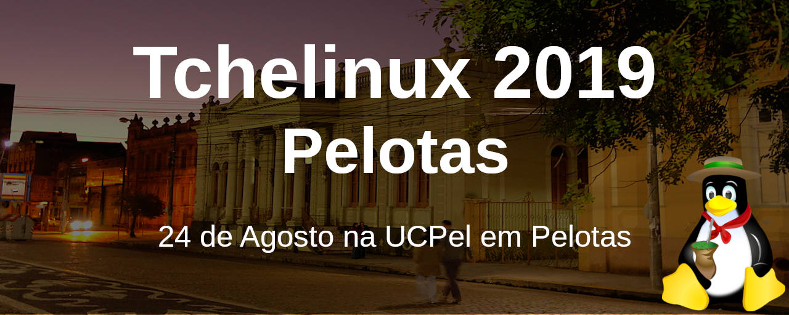

## Sobre

O grupo de usuários de Software Livre Tchelinux, em parceria com a [Universidade Católica de Pelotas](https://ucpel.edu.br/), tem o prazer de convidar a comunidade para participar do evento que ocorrerá no dia **24 de Agosto de 2019 a partir das 8:30h** na UCPel em Pelotas.

## Inscrições

 O evento tem **entrada franca**, porém os participantes são encorajados a doar 2kg de alimentos não perecíveis (exceto sal), que são doados a instituições de caridade da região. Os alimentos são recebidos no momento do credenciamento.

## Certificados

Serão fornecidos certificados digitais para os participantes do evento, que confirmaram sua presença. Para obtê-los, você deverá utilizar o email fornecido na sua inscrição para o evento.

**Importante:** Não esqueça de confirmar sua presença no credenciamento.

## Programação

| 
 Horário 
 | 
 Sala 1   Desenvolvimento 
 | 
 Sala 2   DevOps e Big Data 
 | 
 Sala 3   Distros, IoT e Embarcados 
 | 
 Sala 4   Comunidade, Segurança e Aplicativos
 | 
|:--------------------------:|:-----------------------:|:-----------------------:|:-----------------------:|:-----------------------:|
| **08:00** <td colspan=5>
**Credenciamento**
 |
| **08:50** <td colspan=5>
**Abertura**  Todo o público    Equipe Tchelinux   
 |
| **09:00** <td colspan=4>
[**Keynote: 25 anos de Linux na UCPel**](#Keynote:_25_anos_de_Linux_na_UCPel)  Principiante  Adenauer Yamin e Fabio Olivé Leite  
 |
| **9:45** |  [**Rock & Code - Como criar música programando**](#Rock_&_Code_-_Como_criar_música_programando)   Principiante   Jerônimo Medina Madruga |  [**Afinal o que aconteceu com o HTTP2**](#Afinal_o_que_aconteceu_com_o_HTTP2)   Intermediário   Nelson Dutra Junior |  [**O bom, o mau e o feio: três momentos da instalação do Linux**](#O_bom,_o_mau_e_o_feio:_três_momentos_da_instalação_do_Linux)   Principiante   Vinícius Alves Hax |  [**Explorando Editores de Texto Open Source**](#Explorando_Editores_de_Texto_Open_Source)   Principiante   Gabriel Prestes Ritta |
| **10:30** |  [**Introdução a Vue.js**](#Introdução_a_Vue.js)   Principiante   João Pedro Sabbado Pereira |  [**Entendendo o Systemd**](#Entendendo_o_Systemd)   Intermediário   João Avelino Bellomo Filho |  [**Tecnologia assistiva para deficientes visuais com auxilio de beacons.**](#Tecnologia_assistiva_para_deficientes_visuais_com_auxilio_de_beacons.)   Principiante   Everton Almeida |  [**A caminho da certificação OCAJP 8 (Java 8)**](#A_caminho_da_certificação_OCAJP_8_(Java_8))   Intermediário   Érick Luiz Fonsêca Lopes |
| **11:15** |  [**PHP e PostgreSQL: Dois elefantes ajudando no seu projeto!**](#PHP_e_PostgreSQL:_Dois_elefantes_ajudando_no_seu_projeto!)   Intermediário   Everton Catto Heckler |  [**DevOps: Passado, presente e futuro**](#DevOps:_Passado,_presente_e_futuro)   Principiante   Cristiano dos Santos Diedrich |  [**Fazer ou não fazer (meu próprio SO), eis a questão**](#Fazer_ou_não_fazer_(meu_próprio_SO),_eis_a_questão)   Intermediário   Carlos Santos |  [**Principais motivos pelos quais você precisa ter um backup do seu ambiente**](#Principais_motivos_pelos_quais_você_precisa_ter_um_backup_do_seu_ambiente)   Principiante   Bruna Martins | 
| **12:00** <td colspan=5>
**Intervalo para Almoço**
 |
| **13:30** |  [**Porque Você Deve Aprender Rust**](#Porque_Você_Deve_Aprender_Rust)   Principiante   Julio Biason |  [**Kubernetes para iniciantes**](#Kubernetes_para_iniciantes)   Principiante   Crisitiano dos Santos Diedrich |  [**A anatomia de um CVE: como falhas de segurança surgem e são resolvidas em projetos de Software Livre**](#A_anatomia_de_um_CVE:_como_falhas_de_segurança_surgem_e_são_resolvidas_em_projetos_de_Software_Livre)   Intermediário   Fabio Olive Leite |  [**"Essa câmera faz fotos muito boas, né?"**](#"Essa_câmera_faz_fotos_muito_boas,_né?")   Principiante   Rafael Guterres Jeffman | 
| **14:20** |  [**Introdução ao desenvolvimento Android com Kotlin**](#Introdução_ao_desenvolvimento_Android_com_Kotlin)   Principiante   Ricardo Peixoto Robaina |  [** Construindo um Data Warehouse**](#Construindo_um_Data_Warehouse)   Principiante    Vítor Resing Plentz |  [**O que mudou ao longo de 25 anos trabalhando com Software Livre?**](#O_que_mudou_ao_longo_de_25_anos_trabalhando_com_Software_Livre?)   Principiante   Carlos Santos |  [**(In)Segurança na Internet**](#(In)Segurança_na_Internet)   Intermediário   Diego Luiz Silva da Costa | 
| **16:00** <td colspan=5>
**Coffee-Break**
 |
| **15:40** |  [**Dados no espaço-tempo: Trabalhando com Dados Georreferenciados no MongoDB**](#Dados_no_espaço-tempo:_Trabalhando_com_Dados_Georreferenciados_no_MongoDB)   Principiante   Ricardo Peixoto Robaina |  [**O que é Ciência de Dados **](#O_que_é_Ciência_de_Dados)   Principiante   Lorenzo Fagundes Antunes |  [**Tudo que você sempre quis saber sobre desenvolvimento de software embarcado, mas não sabia pra quem perguntar!**](#Tudo_que_você_sempre_quis_saber_sobre_desenvolvimento_de_software_embarcado,_mas_não_sabia_pra_quem_perguntar!)   Intermediário   Otavio Salvador |  [**Aumentando a segurança em casa - hands on prático e simples**](#Aumentando_a_segurança_em_casa_-_hands_on_prático_e_simples)   Intermediário   Diego Luiz Silva da Costa |
| **16:30** |  [**Filosofando Sobre Testes**](#Filosofando_Sobre_Testes)   Principiante   Julio Biason |  [**Executando aplicações de Machine Learning localmente com Apache Spark**](#Executando_aplicações_de_Machine_Learning_localmente_com_Apache_Spark)   Intermediário   Joel Pinho Lucas |  [**Yocto**](#Yocto)   Intermediário   OSSystems |  [** Maneiras fantásticas de tornar sua organização pessoal mais refrescante do que meias limpas!**](#Maneiras_fantásticas_de_tornar_sua_organização_pessoal_mais_refrescante_do_que_meias_limpas!)   Principiante   Júlio César Medina Madruga |
| **17:20** <td colspan=5>
**Encerramento**  Todo o público   Equipe Tchelinux   
|

## Local

> **Universidade Católica de Pelotas**
> Rua Gonçalves Chaves, 373
> Pelotas - RS

  <iframe src="https://www.google.com/maps/embed?pb=!1m18!1m12!1m3!1d2016.8045882296763!2d-52.34225990526562!3d-31.77464512824778!2m3!1f0!2f0!3f0!3m2!1i1024!2i768!4f13.1!3m3!1m2!1s0x9511b59569451f1b%3A0x2512d7bca00e1ed0!2sCatholic+University+of+Pelotas%2C+Campus+I!5e0!3m2!1sen!2sbr!4v1557290255978!5m2!1sen!2sbr" width="600" height="450" frameborder="0" style="border:0" allowfullscreen></iframe>

## Apoio

### Institucional

### Patrocínio

### Divulgação

